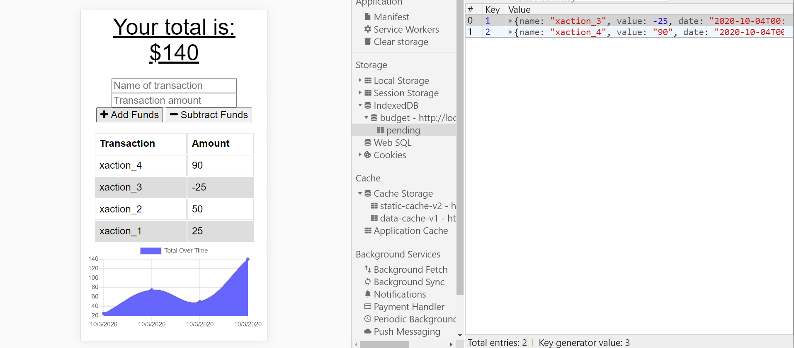

# Budget Tracker PWA

## Description
A budget tracker application that will function either online or offline. A user can add or subtract expenses with a connection and the data will be stored in a database, or go offline and use IndexedDB local database. When brought back online, the data will be added to the tracker. 

## Table of Contents

* [Installation](#installation)
* [Usage](#usage)
* [License](#license)
* [Badges](#badges)
* [Contributing](#contributing)
* [Tests](#tests)
* [Questions](#questions)

## Installation
NPM install Express, Morgan, Mongoose and Compression.

## Usage
A user will be able to add expenses or deposits to their budget either online or offline. 

Offline 

## License
N/A

## Badges
N/A

## Contributing 
Feel free to contact me using the information in the Questions section.

## Tests
None

## Questions?
[jpanakkal22](https://github.com/jpanakkal22)

You can also contact me at josh_panakkal3122@hotmail.com

Heroku live webpage: 
